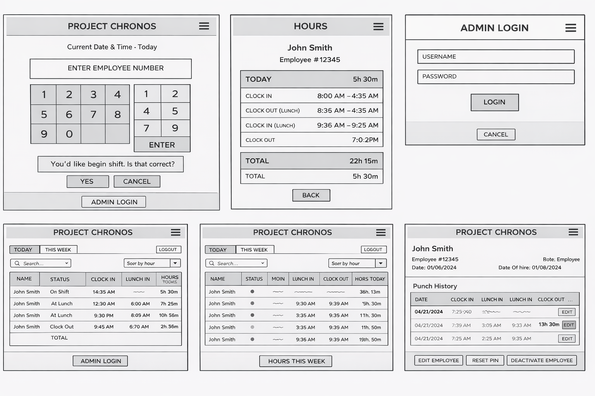

# Wireframes

## Overview

Project Chronos uses low-fidelity wireframes to show the planned structure of the MVP screens. These wireframes are not final visual designs. They are layout references that help explain what information and actions will appear on each page.

The goal of the wireframes is to show:
- which pages exist
- what each page is responsible for
- where major buttons, inputs, and tables will appear
- how employee-facing screens differ from admin-facing screens

Administrators are employees with elevated permissions based on role. The admin views are still shown separately in the wireframes so the kiosk flow remains simple and the management tools remain protected.

---

## Planned MVP Screens

The main MVP screens are:

1. Home / Kiosk Page
2. Employee Hours Page
3. Admin Login Page
4. Admin Dashboard - Today View
5. Admin Dashboard - Week View
6. Admin Employee Detail Page
7. Admin Create Employee Page

---

## Wireframe Image

The current wireframe image is a draft visual reference for the MVP layout plan.

Current file:
- `wireframe.png`

---

## Screen Notes

### 1. Home / Kiosk Page
This page is the main employee-facing screen. It includes:
- current date and time
- employee number input area
- large on-screen number pad
- employee action buttons
- confirmation area
- admin login button

### 2. Employee Hours Page
This page allows the employee to review:
- today’s shift summary
- today’s time punches
- today’s total hours
- current week shift summary
- current week total hours

### 3. Admin Login Page
This page provides a separate login flow for employees with admin-level access. It includes:
- employee number or admin credential input
- PIN or password input depending on final auth design
- login button
- cancel button

### 4. Admin Dashboard - Today View
This page shows:
- employee list
- current statuses
- today’s shift activity
- today’s running totals
- sorting controls
- access to create a new employee

### 5. Admin Dashboard - Week View
This page shows:
- weekly shift summaries
- weekly totals
- employee comparison across the week
- sorting controls
- access to create a new employee

### 6. Admin Employee Detail Page
This page allows admin to:
- review one employee profile
- view shifts
- view time punches
- edit employee information
- reset PIN
- change employee role
- activate or deactivate employee
- correct timekeeping records

### 7. Admin Create Employee Page
This page allows admin to:
- enter employee name information
- enter optional nickname
- assign initial PIN
- assign role
- assign status if needed
- create a new employee account

---

## Important Note

These wireframes are low-fidelity planning documents only.

They do not represent the final styling, exact spacing, or finished interface. The final application may look different while still following the same overall structure and page responsibilities.